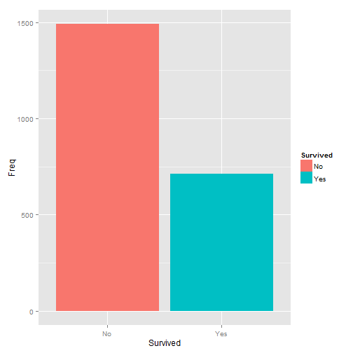
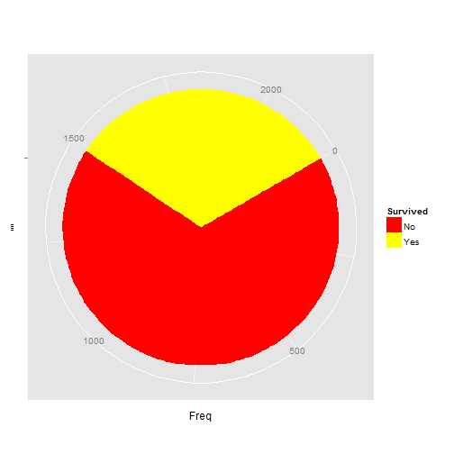

## Introduction

- This presentation show information about 'Survival' app. 'Survival' app let us
filter the information in 'Titanic' dataset and show the results by a chart and 
a data table.

- 'Titanic' data set provides information on the fate of passengers on the fatal
maiden voyage of the ocean liner 'Titanic', summarized according to economic
status (class), sex, age and survival.

- Our app let us filter that information by 'Class', 'Sex' and 'Age' and give the
numbers of survival and no survival passengers. The results can be show by a pie
or by a bar graph and a table.

- When the user change some thing in a category, or charge the graph type, the
table and the graph are automatically updated. 

---

## 'Titanic' Dataset

This dataset is included in package 'datasets' version 3.1.3. Originally is a 
matrix with 4 dimensions, but we transform it to a data frame because is easier
to handle.


```r
head(dataSet <- as.data.frame(Titanic),10)
```

```
##    Class    Sex   Age Survived Freq
## 1    1st   Male Child       No    0
## 2    2nd   Male Child       No    0
## 3    3rd   Male Child       No   35
## 4   Crew   Male Child       No    0
## 5    1st Female Child       No    0
## 6    2nd Female Child       No    0
## 7    3rd Female Child       No   17
## 8   Crew Female Child       No    0
## 9    1st   Male Adult       No  118
## 10   2nd   Male Adult       No  154
```

---

## Filtering Elements
### Class

We can chouse 5 values for this category. Four of this values are from dataset,
but 'All' must be added for let us don't use this category like filtering element.
The values are:


```r
levels(dataSet$Class)
```

```
## [1] "1st"  "2nd"  "3rd"  "Crew"
```

- 'All'.
- '1st'. First class passengers.
- '2nd'. Second class passengers.
- '3rd'. Third class passengers.
- 'Crew'. Crew of the Titanic.

---

### Sex

This category has three values (two from original dataset and 'All' added by us):


```r
levels(dataSet$Sex)
```

```
## [1] "Male"   "Female"
```

- 'All'. You must select this value when you don't want filter data by 'Sex'.
- 'Male'. Male passengers.
- 'Female'. Female passengers.

---

### Age

The values for this category are (two from original dataset and 'All' added by us):


```r
levels(dataSet$Age)
```

```
## [1] "Child" "Adult"
```

- 'All'. You must select this value when you don't want filter data by 'Age'.
- 'Child'. For children.
- 'Adult'. For adults.

---

## Type of Graph

- 'Bar'. When you want a traditional bar chart.


 

---

- 'Pie'. A ggplot chart with polar coordenates. This is the default value.

 

---

## Auxiliary panels

There are three auxiliary panels.

### App Documentation

This panel show us information about the app and its caracteristics. The content
of this panel is obtained from the file 'instructions.html'.

### ui.R

In this panel we can see the code of the application (user interface), obtained
from 'ui.R.html'.

### server.R

Show the code of the server component for the application. This code is obtained
from 'server.R.html'.
